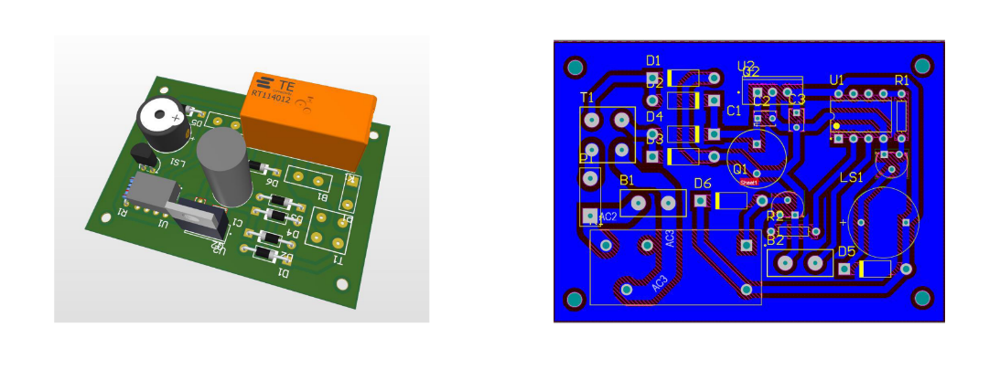

# Safety Switch for Iron 

**A Smart solution for forgetting turn off domestic irons**

+ Busy Lifestyle cause to forget to turn of the  iron frequently 

## Technical Specifications

+ Operating Voltage 230V- 240V
+ Warranty time period is 1 year

## Product Architecture

## Schematic Diagram

## PCB

## Enclosure 

## Group Members

<pre>
+-----------+----------------------+
|   Index   |         Name         |   
+-----------+----------------------+
|  190018V  | K.C.S. Abeywickrama  | 
|  190648C  | K.S.S.Vikasitha      |
|  190712T  | D.R.R.T. Wijesuriya  | 
|  190639B  | B.D.S.Udayantha      | 
+-----------+----------------------+
</pre>
